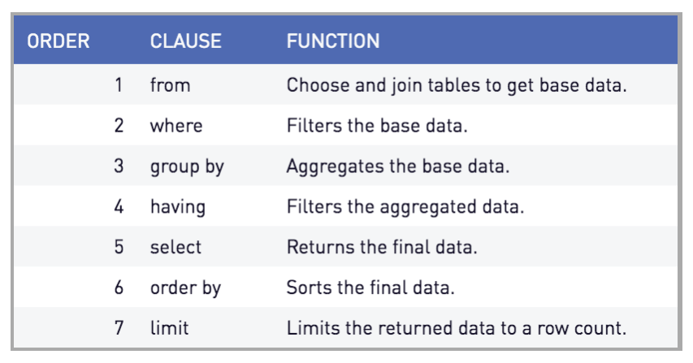

# Creating and querying a SQL database

Practice creating a SQL database and querying it. You should use the data in the file UK-tweets.csv. These data represent a random sample of 10,000 tweets related to the 2014 EP elections in the UK.

1. Create a SQLite database from the data in the file. Test the database by checking the first 5 entries in it.

```{r}
library(DBI)
library(RSQLite)
db <- dbConnect(RSQLite::SQLite(), "data/tweet_db.sqlite")
                
tweets <- read.csv("data/UK-tweets.csv", stringsAsFactors = FALSE)
dbWriteTable(db, "tweets", tweets, overwrite = TRUE)

dbListFields(db, "tweets")
dbGetQuery(db, 'SELECT * FROM tweets LIMIT 5')                
```

2. How many tweets are classified as engaging? (HINT: Use CASE WHEN)

```{r}
dbGetQuery(db, 
  "SELECT COUNT(*) FROM tweets WHERE communication = 'engaging'")

# You could also do:
dbGetQuery(db,
           "SELECT SUM(CASE WHEN communication = 'engaging' THEN 1 ELSE 0 END)
           FROM TWEETS")
```

3. What perecent of tweets are classified as impolite?

```{r}
dbGetQuery(db,
           "SELECT CAST(COUNT(*) AS FLOAT) * 100 / (SELECT COUNT(*) FROM TWEETS)
           FROM TWEETS
           WHERE polite = 'impolite'"
           )

# Instead of the cast command you could also have used 100.0 in the multiplication. 

dbGetQuery(db,
           "SELECT 100.0 * SUM(CASE WHEN polite = 'impolite' THEN 1 ELSE 0 END) / COUNT(*)
           FROM tweets")
```

4. What percent of tweets mention Brexit?

```{r}
dbGetQuery(db,
           "SELECT CAST(COUNT(*) AS FLOAT) * 100 / (SELECT COUNT(*) FROM TWEETS)
           FROM TWEETS
           WHERE text LIKE '%Brexit%'")

# Also:

dbGetQuery(db,
           "SELECT 100.0 * SUM(CASE WHEN text like '%Brexit%' THEN 1 ELSE 0 END) / COUNT(*)
           FROM tweets")


# It is case insensitive. By default, when you load a SQL database the columns are not case sensitive. If you want to use a case sensitive command you need to create a command called collate. 
```


5. Compute the average number of followers for tweets that are impolite and polite.

```{r}
dbGetQuery(db, "SELECT AVG(followers_count) AS avg_followers, polite 
           FROM tweets 
           WHERE polite NOT NULL
           GROUP BY polite
           ")
```


# Practicing working with multiple SQL tables

Practice writing using **JOIN** in SQL queries to answer the questions below. Use the database we created in lecture.

6. How many posts were published each month of the year?

```{r}
db <- dbConnect(RSQLite::SQLite(), "data/facebook-db.sqlite")


dbGetQuery(db, 
           "SELECT SUBSTR(date, 1, 7) AS month,
           COUNT(*) AS post_count
           FROM posts
           GROUP BY month
           ORDER BY post_count DESC"
           )

```



7. What is the average number of likes for members of the House and the Senate? Which group is more popular on average?

```{r}
dbListFields(db, "congress")
dbGetQuery(db, "SELECT * FROM congress LIMIT 5")
dbGetQuery(db, "SELECT * FROM posts LIMIT 5")

dbGetQuery(db,
           "SELECT congress.type, AVG(posts.likes_count) AS average_likes
           FROM  posts JOIN congress
           WHERE posts.screen_name = congress.screen_name
           GROUP BY congress.type")
```

8. What is the average number of likes that posts receive based on the time of the day in which they were published?

```{r}
# CONTINUE
dbGetQuery(db, "SELECT SUBSTR(datetime, 12, 2) AS hour, AVG(likes_count) AS avg_like_count
           FROM posts
           GROUP BY hour")

```

9. Do women receive more comments than men on average?

```{r}
dbListFields(db, "posts")
dbGetQuery(db, "SELECT congress.gender AS gender, AVG(posts.comments_count) AS avg_comments_count
           FROM posts JOIN congress
           ON posts.screen_name = congress.screen_name
           GROUP BY congress.gender")

# It does not look like, both genders receive the same comments engagement.  
```

10. For each type of reaction (haha, love, angry...) compute the average count by party. Are there any systematic differences?

```{r}
dbGetQuery(db, 
          "SELECT congress.party, AVG(posts.likes_count), AVG(posts.comments_count), AVG(posts.shares_count),
           AVG(posts.love_count), AVG(posts.haha_count), AVG(posts.wow_count), AVG(posts.sad_count), AVG(posts.angry_count)
           FROM posts JOIN congress
           ON posts.screen_name = congress.screen_name
           GROUP BY congress.party
           ")
```

11. Compute the total number of "sad" reactions for each domain shared by Republicans. Display the top 10 domains that receive the most "sad" reactions. Then repeat the same for Democrats. What do you find?

```{r}
dbGetQuery(db, "SELECT posts.domain, SUM(posts.sad_count) AS sad_reactions
           FROM posts JOIN congress
           ON posts.screen_name 
           WHERE congress.party = 'Republican' AND posts.domain NOT NULL
           GROUP BY posts.domain
           ORDER BY sad_reactions DESC
           LIMIT 10")


dbGetQuery(db, "SELECT posts.domain, SUM(posts.sad_count) AS sad_reactions
           FROM posts JOIN congress
           ON posts.screen_name 
           WHERE congress.party = 'Democrat' AND posts.domain NOT NULL
           GROUP BY posts.domain
           ORDER BY sad_reactions DESC
           LIMIT 10")

# The cnn, bostonglobe and nytimes are the media that generate most sad reactions. 
```


# Querying a SQL database

Practice writing SQL queries that answer the following questions using the database we created in lecture:

12. Who wrote the post that was shared the most times during this period? What does it say?

```{r}
# db <- dbConnect(RSQLite::SQLite(), "data/facebook-db.sqlite")

dbGetQuery(db, 
           "SELECT screen_name, message, shares_count
           FROM posts
           ORDER BY shares_count DESC
           LIMIT 1")
```

13. What about the post with the most comments?

```{r}
dbGetQuery(db,
       "SELECT screen_name, message, comments_count
       FROM posts
       ORDER BY comments_count DESC
       LIMIT 1")

```

14. Which was the post that received the most likes in January of 2017?

```{r}
dbGetQuery(db,
           "SELECT screen_name, message, link, likes_count
           FROM posts
           WHERE date LIKE '2017-01-__'
           ORDER BY likes_count DESC
           LIMIT 1")

```

15. What was the photo posted by a Member of Congress that received the most "angry" reactions?

```{r}
dbGetQuery(db,
           "SELECT screen_name, message, type, link, angry_count
           FROM posts
           WHERE type = 'photo'
           ORDER BY angry_count DESC
           LIMIT 1")
```

16. What was the post by `senatorsanders` that received the most "angry" reactions? And the most "love" reactions?

```{r}
dbGetQuery(db,
           "SELECT screen_name, message, link, angry_count, likes_count, shares_count, comments_count
           FROM posts
           WHERE screen_name = 'senatorsanders'
           ORDER BY angry_count DESC
           LIMIT 1")

dbGetQuery(db,
           "SELECT screen_name, message, link, angry_count, love_count, shares_count, comments_count, likes_count
           FROM posts
           WHERE screen_name = 'senatorsanders'
           ORDER BY love_count DESC
           LIMIT 1")
```

17. Which was the post mentioning "Trump" that was shared the most? And which was the post that received the most "love" reactions?

```{r}
dbGetQuery(db,
           "SELECT screen_name, message, link, shares_count
           FROM posts
           WHERE message LIKE '%Trump%'
           ORDER BY shares_count DESC
           LIMIT 1")

dbGetQuery(db,
           "SELECT screen_name, message, link, love_count
           FROM posts
           WHERE message LIKE '%Trump%'
           ORDER BY love_count DESC
           LIMIT 1")
```


